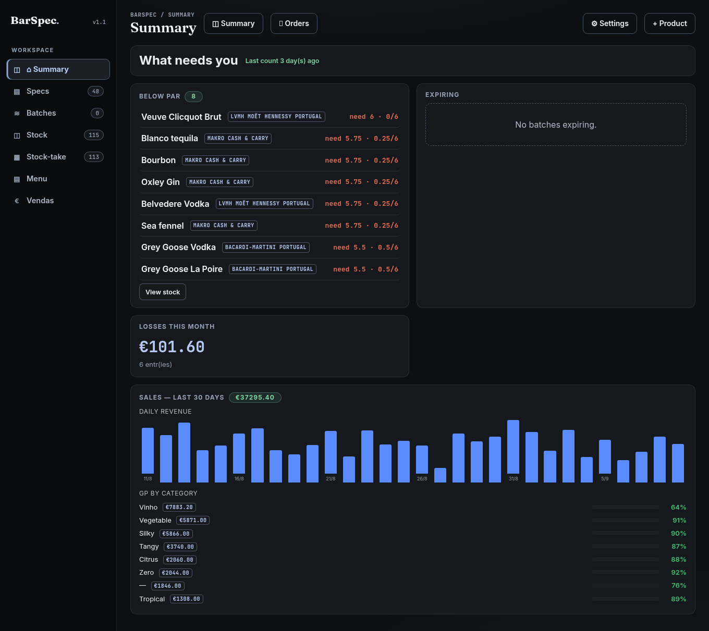
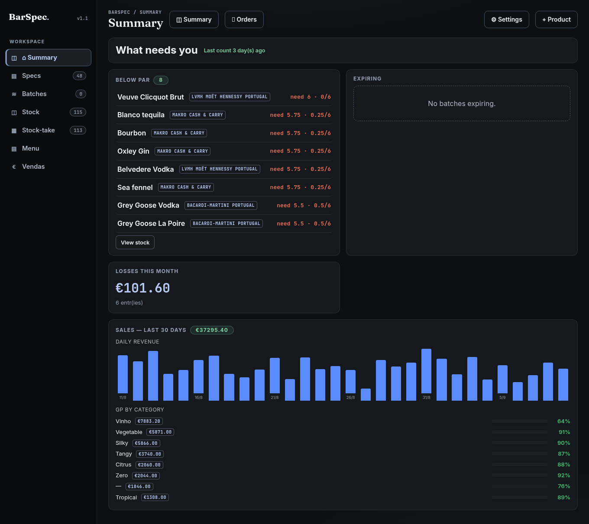
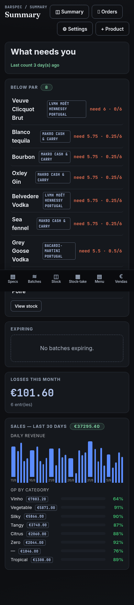
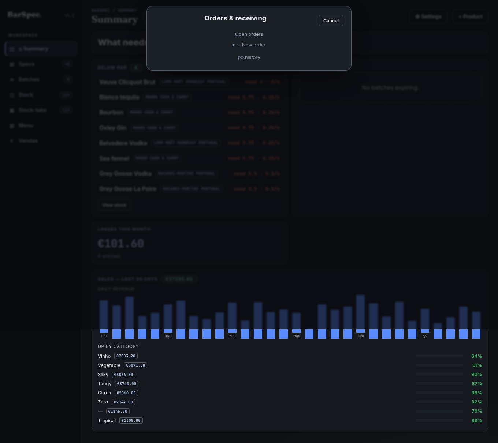

# BarSpec

> Know what every drink *really* costs — and where the money leaks.

Recipe, stock, purchasing and margin manager for **bars, pubs, cafés and
restaurants**. One menu: cocktails, draught from the keg, cans by the case,
wine by the glass *or* the bottle, espresso, softs. Cost is **derived, never
guessed** — change one bottle price and every recipe that uses it updates,
with the impact report in front of you.



Leia em [Português](README.pt-PT.md). Built by **Vitor Vareiro.**

## Why bars use it

- **Cost is derived, never stored.** Volume/weight/piece, yield %, dilution,
  ABV by volume — price suggestions round *up* to €0.50 so the real margin
  never dips below your target (an invariant with a test).
- **Two counts a week → the leak in €.** Shrinkage compares stock *used*
  between counts against what your sales *explain* — and stock-take trends
  show the movement, dead stock and cash asleep on the shelf.
- **Orders that catch price drift.** POs freeze prices at order time;
  receiving flags *stored €11.00 → invoice €11.80?* with one-click apply
  that ripples through every recipe. Every received line feeds the item's
  price history.
- **Sales → actual GP.** Post what you sold per day; re-posting replaces.
  Price/cost are snapshots frozen at posting — future price changes never
  rewrite past GP. Shrinkage, category GP, 30-day revenue, all on one
  attention page.
- **Owner PIN + staff mode.** Money is stripped **server-side** for staff
  (costs, prices, margins never leave the API), not just hidden in the UI.
  Every write outside read-only returns 403. Append-only audit trail on
  price edits.
- **One file, no services.** SQLite + FastAPI + vanilla JS — no build step,
  no ORM, no cloud. Nightly snapshots with a tested restore. Runs on a
  Raspberry Pi if you want.







## Run it

```bash
python3 -m venv .venv && .venv/bin/pip install -r requirements.txt
.venv/bin/python -m uvicorn main:app --host 0.0.0.0 --port 8777
```

Or `docker compose up -d --build` (port 8780, data in `./data`). First
visit: set your owner PIN — the app stays open until you do, by design.

**Try it with a full month of real data** (48 items, 30 days of counts,
sales and a €100 leak story to find):

```bash
BARSPEC_DB=/tmp/argo-demo.db .venv/bin/python ops/seed_argo.py --month
BARSPEC_DB=/tmp/argo-demo.db .venv/bin/python -m uvicorn main:app --port 8791
```

## Tech

Python + FastAPI + SQLite + vanilla JS. One data file, one process, no
external services. Full architecture, unit/unit engine, migration notes and
API map live in the [Developer Guide](docs/DEV_GUIDE.md) — user workflows in
the [User Guide](docs/USER_GUIDE.md), build history in
[CHANGELOG.md](CHANGELOG.md).

```bash
pytest        # 185 tests: pricing, migrations, API, counts, units, batches,
              # yield, categories, dilution, kitchen, allergens, suppliers,
              # audit, auth (incl. brute-force brake), staff, sales,
              # dashboard, purchase orders, stats
npm run e2e   # real-browser smoke (Playwright, 12 flows) on a throwaway DB
```

<details>
<summary>Schema / migrations (15)</summary>

`001_stock` normalize → stock_items + spec_lines · `002` par + count
snapshots · `003` units engine (volume|weight|count) · `004` batches, one
price source · `005` yield % · `006` categories · `007` dilution ·
`008` venue profile · `009` kitchen + loss log · `010` allergens ·
`011` suppliers · `012` append-only audit · `013` sales snapshots ·
`014` purchase packs (case/keg) · `015` purchase orders + receiving ledger.

DB file `barspec.db` (override `BARSPEC_DB=/path` for tests). Online
snapshots under `backups/` (nightly, 14 kept); restore:
`sudo ops/restore.sh backups/barspec-*.db`.
</details>

## Operations

Live service runs under systemd as system Python; deploys snapshot the DB,
restart, verify, push. A health watchdog probes every 10 min and alerts on
downtime. Everything else you need to run it in anger is in the
[Developer Guide](docs/DEV_GUIDE.md).

## Status

Phase A complete: counting, units engine, batches, costing precision, PT-PT,
kitchen lane, security, sales → actual GP + shrinkage, staff roles, purchase
orders + receiving, charts — shipped (2026-09-09, 185 tests). Multi-venue,
hosting and a hosted multi-tenant future are deliberately gated on a real
paying venue — feedback drives the roadmap, not guesses.
