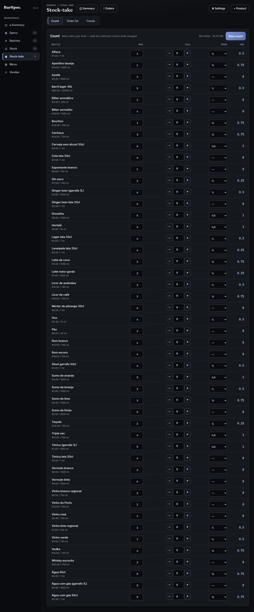
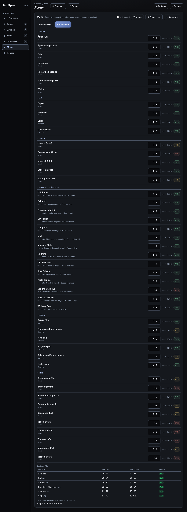
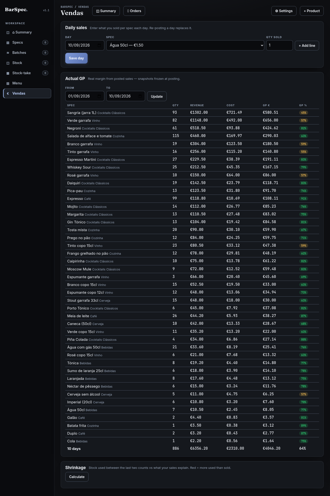

# BarSpec

Gestor de receitas e custos para **bares, pubs, cafés e restaurantes** —
guarde as receitas (bebidas *e* pratos), dimensione qualquer dose para N
serviços, veja o custo por dose e o ABV, e depois **precifique a carta** e
imprima-a. Também faz inventário, perdas e encomendas.

Construído por Vitor Vareiro. Python +
FastAPI + SQLite + JavaScript puro. Sem passo de build, sem ORM — cada query
está visível no `db.py`, cada € é calculado no `pricing.py` (funções puras,
testadas).

## Capturas de ecrã

| Resumo — atenção primeiro | Receita com custo e margem derivados |
|---|---|
|  |  |
| **Contagens — contar, encomendar, tendências** | **Compras — pedidos, receção, desvio de preço** |
|  |  |
| **Carta — com preços, para imprimir, QR** | **Vendas — GP real e encolhimento** |
|  |  |

*Capturas de desktop do conjunto de demonstração (48 artigos, um mês de
contagens e vendas). Corra-o com `ops/seed_argo.py --month` — ver Início
rápido.*

## Início rápido

```bash
python3 -m venv .venv && .venv/bin/pip install -r requirements.txt
.venv/bin/python -m uvicorn main:app --host 0.0.0.0 --port 8777   # http://localhost:8777
```

Docker: `docker compose up -d --build` (porta 8780, dados em `./data`).
A primeira visita cria o PIN do dono — a app fica aberta até o fazer, de propósito.

Quer vê-la cheia de dados reais? Semear um mês e explorar:

```bash
BARSPEC_DB=/tmp/argo-demo.db .venv/bin/python ops/seed_argo.py --month
BARSPEC_DB=/tmp/argo-demo.db .venv/bin/python -m uvicorn main:app --port 8791
```

## Documentação

- **[Guia do utilizador](docs/USER_GUIDE.md)** — o que a app faz, como usar
  cada ecrã, o que significam os números. Para equipa e donos de espaços.
- **[Guia do programador](docs/DEV_GUIDE.md)** — arquitetura, decisões de
  desenho e o *porquê*; uma visita guiada para programadores e quem está a
  aprender.
- **[Porquê das decisões](docs/WHY.md)** — explicações curtas: custos
  derivados, snapshots congelados, porque os pedidos não mexem no stock.

## O que faz

- **Receitas**: nome, copo, método, decoração. Criar / editar / duplicar /
  apagar.
- **Stock**: uma linha por artigo real — `Campari €19 / 700 ml`, café `€18 /
  1 kg`, limas `€3,60 / 12 pc`. Mude um preço **uma vez** e todas as receitas
  que o usam atualizam — o relatório de impacto diz quais e quanto, mesmo
  através de um xarope caseiro.
- **Linhas de receita** referenciam stock (nome + quantidade por linha;
  quantidades com unidade: 30 ml, 2 dash, 9 g, 1 pc) OU um xarope caseiro.
  Nomes desconhecidos criam o artigo de stock automaticamente; preço/ABV/
  tamanho vivem só no artigo.
- **Xaropes**: xaropes caseiros e infusões com custo de mini-receita — total €
  derivado dos ingredientes (linhas ligadas a stock precificam ao vivo; água
  é €0), €/litro, dias de validade, e despeja-se em receitas como qualquer
  garrafa.
- **Categorias**: secções de carta livres nas receitas — filtros em chips
  sobre a lista e secções agrupadas na carta imprimível (60+ receitas
  continuam fáceis de encontrar).
- **Diluição**: % de gelo opcional por receita (shake ≈ 20–25, stir ≈
  10–15). O volume servido e o ABV servido dizem a verdade sobre o que chega
  ao copo; o custo continua a ser a dose medida — a água é grátis.
- **EN / PT-PT**: alternância de idioma num clique (barra superior, lembrada
  por browser). Navegação, formulários, botões, dicas e cartas traduzem;
  números e € nunca traduzem.
- **Pedidos de compra e receção**: encomende por fornecedor com preços
  unitários congelados na altura do pedido; receber regista a entrega,
  fica no histórico e sinaliza **desvios de preço** (custo guardado vs
  fatura) com aplicação num clique + ripple. Receção parcial mantém o
  pedido aberto. Cada linha recebida alimenta o **histórico de preços**
  do artigo. Os POs são o rasto do dinheiro — as contagens continuam a
  ser donas do stock físico. Migração 015.
- **Resumo (página de atenção)**: à primeira vista, em cada visita — abaixo
  do par (última contagem, com fornecedores), xaropes a expirar numa
  semana, perdas do mês em € e lembrete de contagem quando a última tem
  >7 dias. Os cartões saltam para a vista certa.
- **Primeiros passos (onboarding)**: um espaço vazio abre num assistente de
  3 passos (stock → receita → preço) com botões de ação diretos.
- **Exportação e partilha**: a receita completa + stock para .xlsx ou .csv
  (ficheiros do dono/contabilista, com custos), e um QR da carta — aponte um
  telemóvel e a carta abre (link profundo `?view=menu`).
- **Fichas de treino**: imprima um baralho de fichas por receita (⤢ Fichas)
  — uma receita por cartão, quantidades + método + decoração, agrupadas por
  categoria, respeitando o filtro/pesquisa atual. **Os custos nunca
  aparecem** — estas fichas vivem no balcão.
- **Cozinha (K1)**: os xaropes declaram doses — um lote de maionese que rende
  20 mostra **€/dose** na folha de preparação (a matemática de volume
  continua). O registo de perdas (+ Registar perda) transforma derrames/
  desperdícios/estragos em linhas visíveis com motivo — nunca um mistério na
  contagem seguinte.
- **P&L por secção**: sob a carta, margem % por categoria (verde ≥60 /
  âmbar ≥40 / vermelho abaixo) mais **stock parado** — o valor de compra dos
  artigos que nenhuma receita usa, dinheiro sentado na prateleira.
- **Alergénios e dieta (K3)**: cada receita leva os códigos de alergénios
  (14 UE) e etiquetas V/VE/GF — escolhidos em chips no editor, mostrados em
  badges coloridas na receita, impressos nas fichas de treino e incluídos na
  exportação Excel. Os códigos são neutros ao idioma; os nomes resolvem-se
  EN/PT.
- **Definições**: uma janela ⚙ reúne idioma (EN/PT), tamanho do texto
  (A−/A/A+) e unidade de apresentação (ml/cl/oz) — o cabeçalho fica limpo em
  todos os ecrãs.
- **PIN do dono (S1)**: na primeira execução pede para definir um PIN
  (hash pbkdf2 — nunca armazenado em claro). A partir daí a app fica
  **bloqueada** até alguém inserir o PIN (sessão por cookie assinado, 14
  dias). Um botão 🔒 Bloquear nas Definições volta a fechá-la. Cabeçalhos de
  segurança (CSP, frame-deny, nosniff) acompanham todas as respostas.
- **Registo de auditoria (S2)**: o livro de recibos. Cada alteração de preço
  e cada eliminação fica registada antigo → novo com data/hora; Definições →
  Alterações recentes mostra o rasto. O histórico é só-adição — nada edita o
  passado.
- **Modo equipa (staff, só-leitura)**: o dono pode ativar um **PIN da equipa**
  (Definições). Quem entra com ele vê só as receitas (quantidades, método,
  alergénios) e a carta — **nunca custos, preços ou margens**: o servidor
  retira o dinheiro da resposta, não é apenas a UI que o esconde. O resto
  (stock, contagens, vendas, exportações) devolve 403.
- **Vendas e encolhimento (A.7)**: registo diário do que vendeu por receita
  (repetir o mesmo dia substitui) → **GP real** por receita/período, com
  preço/custo congelados no registo (semântica de fatura); e
  **encolhimento** — stock usado entre as duas últimas contagens vs o que as
  vendas explicam, com a fuga em € em destaque.
- **Fornecedores (K4)**: cada artigo de stock indica o seu fornecedor (texto
  livre, sugerido do que já escreveu). A lista de encomendas agrupa *A
  encomendar* e *Acima do par* por fornecedor — um relance por fornecedor,
  uma chamada por fornecedor.
- **Acessibilidade**: escala de texto A−/A/A+ (persistida, zoom só de
  conteúdo), link de salto para o conteúdo, anéis de foco visíveis e
  aria-labels em todos os botões de ícone (✕/✎ dizem o nome do alvo).
- **Contagens**: defina um par por garrafa, conte a prateleira (cheia +
  ¼/½/¾/aberta), receba a lista de encomendas (o que comprar, dinheiro
  parado) e tendências semana a semana.
- **Custo e ABV**: custo = quantidade × (preço ÷ tamanho de compra) em
  ml/g/pc; custo da bebida = Σ linhas; ABV = ponderado por volume. A
  matemática vive no `pricing.py`, espelhada em JS só para pré-visualização
  ao vivo. Diluição por gelo NÃO incluída.
- **Precificação** (o momento da compra): cursor de margem alvo → preço
  sugerido (arredondado a €0,50, para a margem nunca descer abaixo do alvo)
  → guardar o preço de venda. Margem com cor: verde ≥ alvo, âmbar até 10
  pontos abaixo, vermelho abaixo.
- **Impressão da carta**: precifique cada receita (na própria vista da carta
  ou por receita), imprima. A folha impressa mostra nomes + preços apenas —
  os custos ficam fora do papel. Os símbolos de moeda são omitidos de
  propósito (psicologia de carta: pistas de preço suprimem o consumo).

## Correr (dev)

```bash
cd barspec
python3 -m venv .venv && source .venv/bin/activate
pip install -r requirements.txt -r requirements-dev.txt
uvicorn main:app --reload
```

Abra http://127.0.0.1:8000

Na primeira execução são semeadas 5 receitas clássicas com preços reais de
garrafa + preços PT sensatos (Negroni €9, Margarita €10…) para o custo E o
preço demonstrarem logo.

### Pacote de demonstração — "Três Copos — Bar & Cozinha" (fictício)

Um espaço completo e ficcional, para não pedir nada emprestado a ninguém: um
bar de bairro *com cozinha* — 14 cocktails clássicos, cerveja de barril e de
lata, vinhos a copo e à garrafa, refrigerantes, café e uma carta curta de
petiscos. 46 artigos vendáveis, 59 linhas de stock, e um mês inteiro de uso
por trás.

```bash
BARSPEC_DB=/tmp/barspec-demo.db .venv/bin/python ops/seed_demo.py --month
BARSPEC_DB=/tmp/barspec-demo.db .venv/bin/python -m uvicorn main:app --port 8791
# PIN do dono 1234 · PIN de equipa 2468 (ecrã de equipa sem dinheiro)
```

O `--month` fabrica **30 dias de uso real** (determinístico, repetível):
6 contagens semanais, vendas diárias do mês inteiro, 3 lotes datados (xarope
simples, xarope de gengibre, cordial de groselha — os cocktails servem-se
deles), perdas datadas, fornecedores, pars, um pedido recebido e um aberto.
A carta impressa leva o nome do espaço e o rodapé com IVA a 23%.

O `ops/seed_argo.py` continua incluído como extra: uma carta pública real
(The Argo, Vilamoura) resolvida para os ABV declarados — útil para demonstrar
com uma lista de cocktails premium em vez da ficcional.

## Testes

```bash
pytest            # 185 testes: preços, migrações, API, contagens, unidades, xaropes, rendimento, categorias, diluição, cozinha, relatórios, alergénios, fornecedores, auditoria, autenticação (incl. travão anti-força-bruta), equipa, vendas, dashboard, pedidos de compra, estatísticas
npm run e2e       # smoke de browser real (Playwright, 11 percursos): PIN, receitas, PT-PT, filtro de stock, vendas, carta
.venv/bin/python ops/docs-check.py   # números dos docs vs realidade (testes/migrações/e2e)
```

O teste de migrações constrói uma base v0 real e atualiza-a — se passar,
todos os ficheiros de espaço futuros atualizam em segurança. Os testes de
dinheiro cobrem arredondamento ao cêntimo, garrafas sem preço, propagação de
atualizações de preço e a matemática FBE/par/encomenda. O `npm run e2e`
arranca a app real numa base temporária e percorre os fluxos do dono num
Chromium headless (precisa de `npm install` + o cache do Playwright em
`~/.cache/ms-playwright`).

## Esquema / migrações

Esquema base + `migrations/*.sql`, controlado pelo `PRAGMA user_version`. No
arranque o `db.migrate()` aplica os ficheiros pendentes por ordem, cada um
dentro de uma transação. Uma instalação nova percorre o mesmo caminho que uma
atualização — auto-verificável.

- `001_normalize_stock.sql` — `ingredients` (preços duplicados por receita) →
  `stock_items` + `spec_lines`. Idempotente, preserva dados.
- `002_stock_take.sql` — `par_level` nos stock_items (NULL = não contado) +
  instantâneos datados `stock_takes`/`stock_take_lines` (garrafas cheias +
  fração aberta 0/¼/½/¾/1). Conta-se histórico, não estado de UI volátil.
- `003_units.sql` — `dimension` nos stock_items (volume|weight|count) +
  `unit` nas spec_lines (padrão ml, legado byte-idêntico). Unidades
  canónicas: volume→ml, peso→g, contagem→peça. dash = 1 ml, barspoon = 5 ml.
  Unidades permitidas + fatores de conversão no `pricing.py` (fonte única).
- `004_batches.sql` — lotes caseiros: `batches` (nome, método, tamanho_ml,
  data, validade_dias) + `batch_lines` (linhas ligadas a stock derivam pelo
  motor; texto livre leva € digitado); `spec_lines` ganha `batch_id`
  anulável + CHECK que obriga exatamente uma de garrafa/lote por linha. Dose
  = quantidade × (total do lote ÷ tamanho); impacto de preço de dois níveis
  percorre garrafa → lotes → receitas.
- `005_yield.sql` — `yield_frac` nos stock_items (padrão 1.0, legado
  byte-idêntico): aproveitamento do comprado para quebras de corte/confeção.
  €6 ÷ (1000 g × 0.80) precifica carne limpa com honestidade; flui por
  receitas E lotes; o impacto herda.
- `006_categories.sql` — `category` nas receitas (secção de carta livre) +
  índice. Chips na lista + secções agrupadas na carta imprimível. PUTs
  parciais (edições de preço na carta) nunca a apagam (exclude_unset);
  duplicados mantêm categoria e linhas de despejo de lote.
- `007_dilution.sql` — `dilution_pct` nas receitas (padrão 0, byte-idêntico):
  derretimento no shake/stir. Volume servido = receita × (1 + pct/100), ABV
  servido = ABV ÷ (1 + pct/100); custo inalterado (água é grátis).
- `008_settings.sql` — perfil do espaço chave/valor (nome, IVA %) para o
  título e rodapé da carta impressa.
- `009_kitchen.sql` — verdade da cozinha: `servings` nos lotes (nº de doses
  → custo por dose na folha de preparação) + registo de perdas
  `stock_adjustments` (delta canónico assinado + motivo: derrames,
  desperdícios, estragos, correções).
- `010_allergens.sql` — listas de códigos `allergens` + `dietary` nas
  receitas (14 alergénios UE, V/VE/GF); os nomes resolvem-se por idioma na
  exibição/exportação.
- `011_supplier.sql` — `supplier` nos artigos de stock (texto livre,
  datalist); a lista de encomendas agrupa por fornecedor para encomendar
  fornecedor a fornecedor.
- `012_audit.sql` — rasto de auditoria só-adição: cada alteração de preço
  (stock + receita) e cada eliminação, registada antigo → novo com data/hora.
  Só leitura; o histórico nunca é editado.
- `013_sales.sql` — vendas diárias por (dia, receita), quantidades
- `014_packs.sql` — packs de compra (caixa/keg) nos artigos de stock
- `015_purchase_orders.sql` — pedidos de compra + receção (histórico de preços)
  substituíveis (idempotente); preço/custo são instantâneos congelados no
  registo (semântica de fatura — preços futuros nunca reescrevem o GP
  passado). Alimenta o GP real e o encolhimento stock-vs-vendas.

Ficheiro DB: `barspec.db` (substitua com `BARSPEC_DB=/caminho` para testes).

## API

| Método | Caminho | O quê |
|--------|---------|-------|
| GET | `/api/specs` | lista (+ custo, preço, margem) |
| POST | `/api/specs` | criar |
| GET | `/api/specs/{id}` | detalhe + linhas + resumo + preço sugerido |
| PUT | `/api/specs/{id}` | atualizar (incl. `price_eur`, `target_gp`) |
| DELETE | `/api/specs/{id}` | apagar (cascata nas linhas) |
| POST | `/api/specs/{id}/duplicate` | copiar receita + linhas |
| POST | `/api/specs/{id}/lines` | adicionar linha (`name` resolve/cria stock, ou `batch_id` para lote; `unit` opcional) |
| PUT | `/api/lines/{id}` | mudar quantidade (e unidade) |
| DELETE | `/api/lines/{id}` | remover linha |
| GET | `/api/stock` | artigos + contagem de uso |
| POST | `/api/stock` | adicionar artigo (`dimension`: volume\|weight\|count; 409 se duplicado) |
| PUT | `/api/stock/{id}` | editar artigo — **impacto de preço na resposta** (mesmo via lotes) |
| DELETE | `/api/stock/{id}` | apagar (409 se alguma receita ou lote o usa) |
| PATCH | `/api/stock/{id}/par` | definir/limpar par |
| GET | `/api/batches` | lotes + custo derivado, €/ml, ABV, validade |
| POST | `/api/batches` | criar lote |
| GET/PUT/DELETE | `/api/batches/{id}` | detalhe / editar meta / apagar (400 se usado por receitas) |
| POST | `/api/batches/{id}/lines` | adicionar ingrediente (nome de stock liga ao vivo; texto livre precisa `cost_eur`) |
| DELETE | `/api/batches/lines/{id}` | remover linha do lote |
| GET | `/api/stock-takes/sheet` | lista de contagem: itens com par pré-preenchidos do último instantâneo |
| POST | `/api/stock-takes` | guardar instantâneo → devolve a revisão de encomenda |
| GET | `/api/stock-takes/last` | revisão de encomenda do último instantâneo (encomendar + dinheiro parado) |
| GET | `/api/stock-takes/trends` | movimento entre as duas últimas contagens + lista de stock parado |
| GET | `/api/menu` | vista da carta com preços |
| GET | `/api/settings` · PUT `/api/settings` | perfil do espaço (nome, IVA %) |
| GET | `/api/report/pnl` | P&L por secção: margens por categoria + € de stock parado |
| GET | `/api/stock-adjustments` | últimas linhas do registo de perdas |
| POST | `/api/stock/{id}/adjust` | registar derrame/desperdício (delta assinado + motivo) |
| GET | `/api/export/specs.xlsx` · `/api/export/specs.csv` | livro de receitas (ficheiro do dono: custos, dieta, alergénios) |
| GET | `/api/export/stock.xlsx` · `/api/export/stock.csv` | folha de stock (incl. fornecedor) |
| GET | `/api/export/menu-qr.svg?url=…` | QR SVG para um link profundo da carta |
| GET | `/api/audit` | últimas linhas do rasto de auditoria |
| POST | `/api/sales` · GET `/api/sales` · DELETE `/api/sales/{id}` | registar um dia de vendas (idempotente por dia+receita) / listar / apagar linha |
| GET | `/api/sales/summary?from_day&to_day` | GP real por receita + totais do período |
| GET | `/api/sales/shrinkage` | stock usado (últimas 2 contagens) vs esperado pelas vendas — a fuga em € |
| GET | `/api/dashboard` | resumo de atenção: abaixo do par, a expirar, perdas €, idade da contagem |
| POST | `/api/pos` | abrir PO (preços congelados) · `GET /api/pos` · `POST /api/pos/{id}/receive` (parcial ok, relatório de desvio) · `GET /api/stock/{id}/price-history` |
| GET/POST | `/api/auth/status` · `/api/auth/setup` · `/api/auth/login` · `/api/auth/logout` | gate do PIN do dono (as rotas protegidas devolvem 401 sem cookie) |

## Operações

- **Cópias de segurança** — todas as noites às 03:17 via `barspec-backup.timer`
  (systemd): instantâneo sqlite online para `backups/`, verificação de
  integridade, 14 mantidas, registo em `backups/backup.log`. Restauro:
  `sudo ops/restore.sh backups/barspec-XXXX.db` (para o serviço, guarda a base
  atual, verifica no arranque). Execução manual: `python3 ops/backup.py`.

## Próximos passos (não iniciados)

- Cache de leitura offline PWA (service worker — precisa de HTTPS)

> Cópia de segurança: apenas local, todas as noites (03:17, 14 mantidas) —
> decisão de V (2026-09-08): sem destino offsite, a máquina é o espaço do
> servidor.

## Licença

**GNU AGPL-3.0** — ver [LICENSE](LICENSE). Podes usar, estudar, modificar e
auto-alojar o BarSpec livremente; se correres uma versão modificada como
serviço em rede, a AGPL obriga-te a publicar as tuas alterações.

**Licença comercial disponível a pedido** — se quiseres integrar o BarSpec num
produto fechado ou oferecê-lo como serviço alojado sem as obrigações de
divulgação da AGPL, contacta-me para uma licença comercial (dupla licença;
o copyright é meu).
